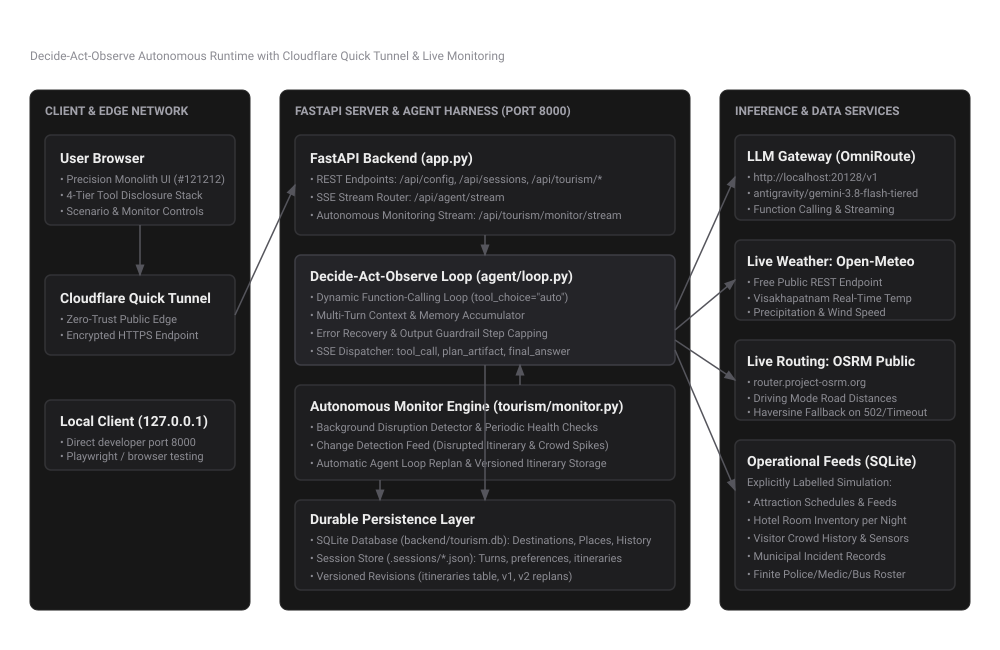
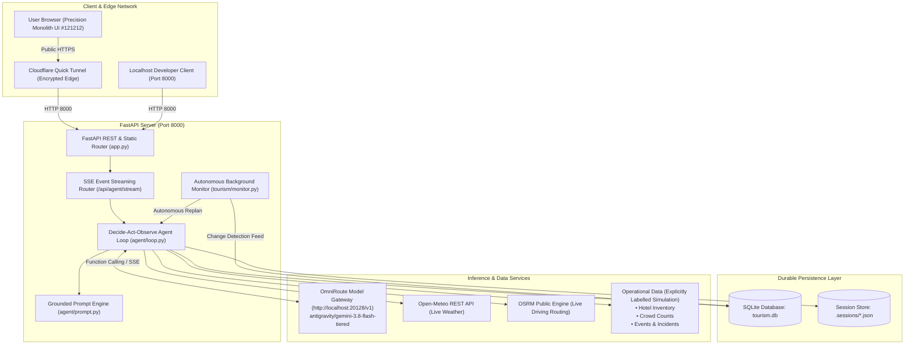

# Limen — Tourism Management Agent

## Live Demo
[Open the live demo](https://documents-interfaces-atomic-calls.trycloudflare.com)

> **Important Notice:** The live demo above is hosted via a Cloudflare Quick Tunnel attached to a live running local workbench instance. The Quick Tunnel URL is temporary and active while the host PC remains powered and online.

---

**Problem Statement:** PS-10 — Tourism Management Agent  
**Target City:** Visakhapatnam, India (`Asia/Kolkata`)  
**Product Specification:** Complete Autonomous Tourism Decision, Municipal Operations & Replanning Platform  
**Design System:** Precision Monolith Developer Workbench (`#121212` warm obsidian palette)

---

## Product Description

Limen is a lightweight, competition-grade autonomous AI agent platform and municipal decision workbench built on FastAPI, SQLite, and a rigorous decide-act-observe agent runtime. Unlike scripted chatbots that wrap prompts around hardcoded pipelines, Limen gives language models dynamic function calling over domain-validated municipal tools, real-time weather and routing sources, per-night accommodation inventory, crowd sensor projections, and background self-healing monitoring.

When real-world conditions change—such as an emergency attraction closure or traffic congestion—Limen's autonomous background monitor detects the incident, invokes the agent loop to compute a valid detour, updates the visitor's itinerary, and increments the versioned plan automatically.

---

## Implemented Autonomous Capabilities

Limen delivers two genuine autonomous capabilities meeting and exceeding the hackathon requirements:

1. **Dynamic Model-Selected Tool Chaining with Grounded Output Validation**:
   - The model dynamically decides which tools to invoke, in what order, and with what arguments based on runtime observations.
   - It chains up to 8 steps autonomously: inspecting opening hours, checking road disruptions, finding available accommodations for specific nights, extrapolating crowd spikes, and calculating municipal staffing surpluses or deficits.
   - Outputs are strictly grounded in structured SQLite records and live APIs; the agent surfaces explicit unknown and unavailable states rather than hallucinating facts.

2. **Autonomous Background Monitoring & Self-Healing Itinerary Replanning**:
   - A dedicated asynchronous background worker checks active visitor itineraries against real-time operational feeds.
   - When a disruption occurs (e.g. an emergency maintenance closure at INS Kursura Submarine Museum or a crowd surge at Kailasagiri), the monitor autonomously detects the affected stop.
   - Without requiring human intervention or manual re-prompting, the monitor invokes the agent loop, replaces the closed venue with an open alternative (e.g. Visakha Museum), re-computes travel routes, updates versioned records (e.g. v1 → v2), and pushes live Server-Sent Events to the client.

---

## Architecture Diagram





Detailed architectural specifications and component contracts are documented in [`docs/architecture.md`](docs/architecture.md).

---

## Distinction Between Live Sources and Simulated Data

To maintain absolute technical honesty, Limen enforces a strict boundary between live external integrations and simulated operational datasets:

| Data Category | Source / Provider | Mode & Handling |
|---|---|---|
| **Current Weather** | Open-Meteo REST API | **Live & Public** (No API key required; live temperature, humidity, wind speed for Visakhapatnam). |
| **Driving Distances** | Project OSRM Public Server | **Live & Public** (Driving profile; automatic Haversine fallback if public server returns 502 or times out). |
| **Attraction Hours & Specs** | Curated Seed DB (`tourism.db`) | **Live OpenStreetMap ground truth** for coordinates/names; verified schedules for Visakhapatnam attractions. |
| **Pedestrian / Traffic Routing** | Local Deterministic Estimation | **Simulated / Calculated** (Public OSRM does not support pedestrian profiles or live road speed sensors). |
| **Hotel Room Inventory** | SQLite Seed Fixtures | **Explicitly Simulated** (Evaluated per-night; real-time booking engine APIs are simulated for the hackathon). |
| **Crowd Counts & Occupancy** | SQLite Seed Fixtures | **Explicitly Simulated** (Synthetic live sensor headcounts and historic hourly curves). |
| **Municipal Incidents & Alerts** | SQLite Seed Fixtures | **Explicitly Simulated** (Scenario closures and infrastructure maintenance events). |
| **Staffing & Emergency Assets** | Finite Roster Fixtures | **Explicitly Simulated** (Strictly finite police patrols, ambulances, and municipal transit buses). |

The web interface features a dedicated **Data Mode Switch**:
- **Scenario Mode**: Uses realistic, time-aware simulated feeds to demonstrate complete end-to-end municipal workflows.
- **Live Mode**: Treats unintegrated operational feeds as unknown/unavailable, demonstrating transparent failure handling.

---

## Setup and Startup Instructions

### Prerequisites
- Python 3.11+
- Git
- Access to an OpenAI-compatible model provider (e.g. OmniRoute, Ollama, OpenRouter)

### 1. Install Dependencies
```bash
git clone https://github.com/lupixele/limen.git
cd limen
pip install -r backend/requirements.txt
```

### 2. Configure Environment Variables
Copy the sanitized environment template:
```bash
cp backend/.env.example backend/.env
```

Set the required environment variable names (values are kept secure and local):
- `OPENAI_BASE_URL`: Base URL for model completions (defaults to `http://localhost:20128/v1`).
- `OPENAI_API_KEY`: API key for model completions.
- `ACTIVE_MODEL`: Active model identifier (e.g. `antigravity/gemini-3.8-flash-tiered`).
- `DEMO_CITY`: Primary destination city (defaults to `Visakhapatnam`).
- `DEMO_TIMEZONE`: Destination timezone (defaults to `Asia/Kolkata`).
- `LIMEN_DB_PATH`: SQLite database path (defaults to `backend/tourism.db`).
- `DATA_MODE`: Initial data mode (`scenario` or `live`).

### 3. Initialize or Reset Database
To seed the database with Visakhapatnam attractions, hotel inventory, and event schedules:
```bash
python backend/tourism/seeds.py --reset
```

### 4. Start the Application Server
```bash
python -m uvicorn app:app --app-dir backend --host 127.0.0.1 --port 8000
```
Open [http://127.0.0.1:8000](http://127.0.0.1:8000) in your browser.

---

## Demo Script & Evaluation Guide

### 1. Tourist Itinerary Planning
- Prompt: *"Plan a 1-day itinerary in Visakhapatnam starting at 09:00 AM with an 8-hour window and an INR 1500 budget."*
- The agent calls `query_open_places`, filters for operational attractions, and invokes `build_itinerary`.
- A structured table appears in the **Inspector Pane** with schedule, duration, admission fees, and route transit times.

### 2. Multi-Day Accommodation Query
- Prompt: *"Find a hotel for 2 adults for 2 nights starting tonight under INR 5000 total."*
- The agent calls `query_accommodations` which inspects availability across *both* consecutive calendar dates.

### 3. Autonomous Monitoring & Incident Replanning
- Click **"Start Monitor"** in the top scenario strip. The monitoring indicator pulses amber.
- Click **"⚡ Simulate Closure"** to trigger an emergency maintenance closure at INS Kursura Submarine Museum.
- The background monitor detects the disrupted itinerary, invokes the agent loop, detours to an open venue (e.g. Visakha Museum), and persists Version 2 of the itinerary.
- Click **"↺ Reset Data"** to restore baseline operational data at any time.

### 4. Municipal Staffing & Resource Allocation
- Prompt: *"Which attractions face crowd surges today, and where should municipal authorities deploy additional police and ambulances?"*
- The agent calls `rank_crowds` and `project_crowd_surge` to evaluate headcount trends.
- It calls `calculate_staffing_requirements` and `allocate_authorities_resources` to dispatch assistance strictly from finite municipal inventories without overallocating.

---

## Known Limitations

1. **Temporary Demo Availability**: The live demo tunnel URL is served directly from the development host. If the host machine reboots or sleeps, the URL may disconnect.
2. **Public Routing Profile**: Live road distances use the public OSRM server (`router.project-osrm.org`) which only provides vehicular driving graphs. Pedestrian transit times use internal Haversine calculations.
3. **Live Operational Sensor APIs**: Municipal crowd sensor feeds and real-time hotel PMS inventory are simulated in SQLite fixtures as public live municipal APIs do not exist for the demo city.

---

## Automated Verification & Test Suite

All 36 unit and integration tests pass cleanly:
```bash
PYTHONPATH=backend python -m unittest discover -s backend/tests -v
```
- 18 baseline harness tests (`test_api.py`, `test_loop.py`, `test_prompt.py`, `test_tools.py`)
- 16 domain tourism tests (`test_tourism.py`)
- 7 autonomous monitoring & agent integration tests (`test_integration_monitor_agent.py`)
