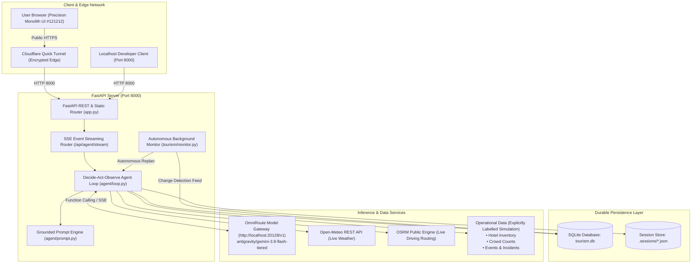

# Limen Architecture Specification

This document specifies the actual implemented architecture of the Limen Autonomous Tourism Management Agent platform.

## Architectural Diagram

## Core Architectural Components

1. **User Interface (`backend/static/`)**:
   - Built under the "Precision Monolith" dark obsidian design system (`#121212` background, `#171717` rails, `#1c1c1c` panels, `#222222` composer).
   - 4-Tier Progressive Tool Disclosure:
     - Tier 1: 24px summary row with icon-to-chevron hover morph, tool name, compact arguments, and status badge.
     - Tier 2: Inline visible result summary bar.
     - Tier 3: Expandable inline raw JSON arguments and formatted inspection view.
     - Tier 4: Crimson execution failure notification surfacing raw error causes honestly.
   - Dual data mode selector: `Scenario (Simulated Feeds)` vs `Live (Unavailable Feeds Stay Unknown)`.
   - Real-time Destination Context & Scenario Controls (Visakhapatnam live weather, active disruptions, simulated emergency closure trigger, and background monitor status).

2. **FastAPI Application (`backend/app.py`)**:
   - High-throughput asynchronous ASGI server with endpoints for configuration management, session lifecycle, scenario triggers, and health diagnostics.
   - Secure config masking ensuring zero secret leakage to clients or tunnels.
   - Session-scoped SSE streams with explicit `session_id`, `run_id`, and `invocation_id` metadata.

3. **Decide-Act-Observe Agent Loop (`backend/agent/loop.py`)**:
   - Pure function-calling autonomous loop using standard OpenAI-compatible tool specifications (`tools` parameter with `tool_choice="auto"`).
   - Runtime context accumulation: records each `assistant` tool call and corresponding `role: tool` response matching exact call IDs.
   - Step limit guardrails (`max_steps`) guarding against runaway recursion.
   - Output table extraction: automatically yields generalized tabular artifacts whenever tools return structured records.

4. **Autonomous Monitoring & Replanning (`backend/tourism/monitor.py`)**:
   - Background periodic worker checking active itinerary health against real-time disruption tables.
   - Single-task session isolation ensuring no overlapping loops per session.
   - Automatically invokes the model-selected agent loop upon detecting disruptions (e.g. emergency attraction closures), producing an incremented version (e.g. v2) and persisting the revised plan without human intervention.

5. **Tourism Domain Engine (`backend/tourism/`)**:
   - 10 Schema-validated tools covering the complete end-to-end municipal and visitor workflow:
     1. `query_open_places`: Hours, admission, category, and real-time open status.
     2. `build_itinerary`: Constraint-aware daytime scheduling with budget tracking.
     3. `calculate_route`: Driving route distances from OSRM with automatic Haversine fallback.
     4. `check_disruptions`: Weather, traffic, and emergency facility closure alerts.
     5. `query_accommodations`: Per-night inventory validation across multi-day stays.
     6. `query_events`: Date-filtered local festivals, sports, and cultural happenings.
     7. `rank_crowds`: Current headcount and capacity occupancy percentage rankings.
     8. `project_crowd_surge`: Deterministic 1-hour trend extrapolation with safety threshold flags.
     9. `calculate_staffing_requirements`: Demand-proportional role staffing recommendations.
     10. `allocate_authorities_resources`: Greedy priority dispatch from strictly finite municipal inventories.
